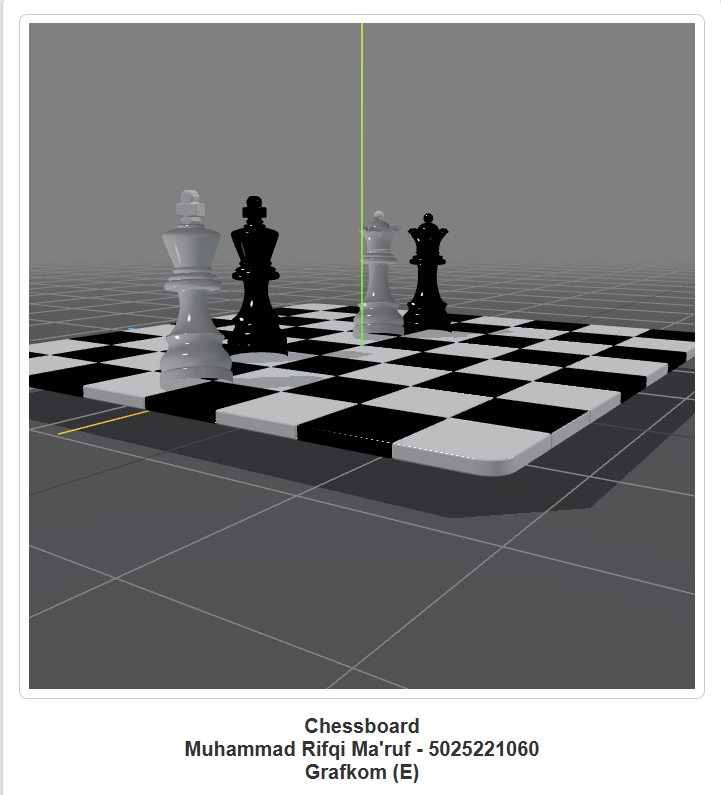

# Chessboard Visualization

| Name                 | NRP        | Class                       |
|----------------------|------------|----------------------------|
| Muhammad Rifqi Ma'ruf | 5025221060 | Jaringan Komputer (D)      |

## Project Overview
This project visualizes a chessboard using Three.js, a JavaScript library for 3D graphics. The interface is designed to display a large chessboard model inside a styled container made with blender. 

## Prerequisites
- A modern web browser (e.g., Chrome, Firefox, Edge).
- Node.js installed (or other web server).

## Installation and Usage
1. Clone this repository:
   ```bash
   git clone <repository-url>
   ```
2. Navigate to the project directory:
   ```bash
   cd chessboard-visualization
   ```
3. Open `index.html` directly in your browser, or serve it using a local server:
   ```bash
   npx serve .
   ```


## Preview



## License
This project is licensed under the MIT License. Feel free to use, modify, and distribute this project.

---


